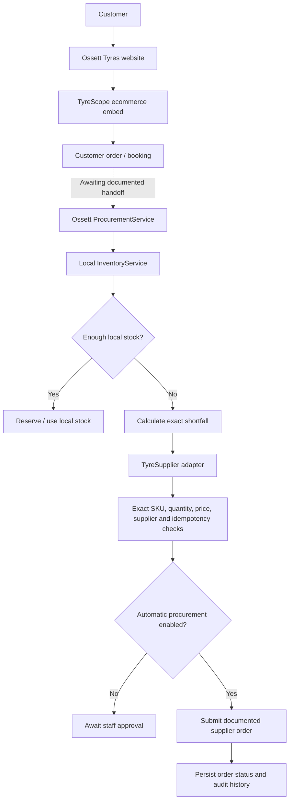

# TyreScope ecommerce and procurement architecture

## Status

- TyreScope ecommerce: **ready for official configuration**. The page and embed boundary are implemented, but Ossett's account-specific official embed URL/snippet has not been supplied.
- Procurement automation: **architecture and deterministic service implemented; production integrations intentionally unavailable**. Local inventory, persistent storage, and a documented supplier API are still required.
- Automatic purchasing: **off by default**. No production supplier adapter can submit an order in the current codebase.

TyreScope ecommerce and Ossett procurement are separate capabilities. The customer-facing ecommerce experience can operate while procurement automation remains disabled.

## Architecture



The dashed handoff is not active because no documented TyreScope order payload, webhook, or authenticated partner API has been supplied.

## Customer flow

The established `/order-your-tyres-online` route is the canonical tyre page. It retains the Ossett header, footer, fitting explanation, trust/support copy, call fallback, and the existing DVLA/One Auto enquiry.

When `TYRESCOPE_EMBED_URL` contains the official HTTPS account-specific embed URL, the page loads the ecommerce experience lazily. It maintains a stable loading state and exposes a titled iframe. A load error or timeout reveals the existing vehicle lookup and direct workshop contact route instead of leaving an empty frame.

When the variable is missing or invalid, no iframe URL is created. Customers see the existing registration/fitment enquiry. Local development also displays a setup note explaining what is missing.

## Required TyreScope information

Before enabling the live embed, obtain from TyreScope/Bond:

1. The official account-specific installation snippet, approved iframe URL, or script URL.
2. Ossett's account identifier and the instructions for associating the plugin with that account.
3. Classification of every supplied value as public or secret.
4. Any required allowed-domain, Content Security Policy, cookie, and privacy instructions.
5. A sandbox/test tenant or official non-purchasing test procedure.

Before implementing supplier procurement, obtain:

1. A current official API specification for supported stock, product, quote, order, and status operations.
2. Authentication and credential-rotation documentation.
3. Exact SKU/product identity rules and price/currency semantics.
4. Sandbox credentials and explicit confirmation that testing cannot create a real wholesale purchase.
5. Idempotency guarantees, retry rules, and timeout reconciliation instructions.
6. Fastrac order-lifecycle documentation.
7. Webhook payloads and signature-verification rules, if webhooks are supported.

Public TyreScope product pages describe an ecommerce plugin linked to a garage's Bond account, but they do not publish these technical contracts. The code therefore does not guess them.

## Embed implementation

- `tyrescope-embed.js` validates the configured URL, manages loading/ready/error/unavailable states, and reveals the current contact/registration fallback when needed.
- `app.js` owns the Ossett-branded page composition.
- `server.py` and `api/config.py` expose only the validated public embed URL to the browser.
- `TYRESCOPE_ACCOUNT_ID` remains server-side and unused until the official integration contract explains how it must be applied.

Only HTTPS embed URLs without embedded usernames or passwords are accepted. Private credentials must never be placed in `TYRESCOPE_EMBED_URL`.

## Inventory integration

`lib/tyres/inventory.py` defines `InventoryService.get_available_quantity(product)`.

- `UnconfiguredInventoryService` is the production-safe default and reports that local inventory is not configured.
- `MockInventoryService` is marked `test_only` and is used only by automated tests/development harnesses.

Production must connect the interface to Ossett's actual inventory system. The application never silently interprets missing inventory as zero stock.

## Procurement domain

`lib/tyres/` contains:

- exact tyre/product, request, inventory, stock-check, quote, supplier-order, customer-order, audit, and state models;
- deterministic validation and shortfall calculation;
- configurable safety rules;
- supplier, inventory, and persistence interfaces;
- explicit unconfigured production adapters;
- an auditable `ProcurementService`.

The service validates the exact product and quantity, checks idempotency before supplier work, checks local stock, calculates only the shortage, validates supplier availability/quote/SKU/price/policy, and either requests approval or invokes the configured supplier adapter.

No LLM participates in product matching, quantity, pricing, status transitions, or purchasing.

## Shortfall calculation

```text
quantityToOrder = max(requestedQuantity - availableLocalStock, 0)
```

The calculation rejects invalid/negative inputs and has unit coverage for `4-4=0`, `8-3=5`, `4-0=4`, and `2-10=0`.

## Automatic ordering safety

Automatic purchasing remains off unless `PROCUREMENT_AUTO_ENABLED=true`. Even when enabled, every configured rule must pass:

- maximum automatic order value;
- maximum automatic quantity;
- maximum unit price;
- allowed supplier;
- expected quote currency;
- exact supplier SKU;
- idempotency/duplicate protection.

The committed monetary and quantity defaults are zero, so merely enabling the feature flag is insufficient to authorize spend. A production supplier adapter and durable repository are also absent.

When automation is disabled after a valid quote, the order becomes `AWAITING_PROCUREMENT_APPROVAL`. An unauthenticated browser has no endpoint that can approve or trigger a wholesale order.

## Idempotency

Each `TyreRequest` requires an internal idempotency key. `ProcurementService` atomically claims that key in the repository before any stock/supplier action and blocks duplicates. A production repository must implement this as a database uniqueness constraint or equivalent atomic operation. If an eventual official supplier API accepts an idempotency key, the adapter must pass through this same internal key according to that documented contract.

A supplier timeout or ambiguous response transitions to `AWAITING_SUPPLIER_RECONCILIATION`. The service does not automatically retry a purchase because the first request may have succeeded.

## Order states and customer language

Internal state is defined by the `OrderStatus` enum, including request, stock, approval, supplier, delivery, fitting, completion, failure, cancellation, manual-review, and reconciliation states. Customer-facing status mapping deliberately hides wholesale cost, internal IDs, policy limits, supplier credentials, and internal error details.

## Audit and observability

Every significant procurement decision adds a timestamped `AuditEvent` to the order and emits a minimal server log containing only event type and internal order ID. The recorder filters known credential/payment fields and never logs customer phone numbers or API keys.

Production observability must be connected to Ossett's existing operational tooling when one is chosen; no new provider was introduced.

## Persistence and staff visibility

There is no database or authenticated admin area in the current site.

- `UnconfiguredOrderRepository` fails explicitly in production.
- `InMemoryOrderRepository` is marked `test_only`; it is not production storage and loses data on restart.
- No staff dashboard or staff-only HTTP endpoint has been exposed without authentication.

Before real order processing, add durable persistence using the chosen production database and an authenticated staff surface. That future view can read the existing `CustomerTyreOrder` fields for customer reference, vehicle registration, exact tyre, quantity, local/wholesale quantities, supplier/reference, costs, customer price, state, fitting date, timestamps, errors, and audit history.

## Failure handling

The architecture explicitly distinguishes invalid input, inventory unavailability, supplier not configured, out of stock, wrong SKU, quantity mismatch, price/policy rejection, timeout, ambiguous outcome, duplicate request, and persistence unavailability. Customer cancellation and later delivery/fitting transitions are represented in the state enum but require persistent order handling and an authenticated staff workflow.

No webhook route or signature algorithm exists because no official webhook specification has been supplied.

## Environment variables

Application-defined names (not claimed to be official TyreScope names):

| Variable | Exposure | Default / purpose |
| --- | --- | --- |
| `TYRESCOPE_EMBED_URL` | Browser-public after HTTPS validation | Empty; official account-specific embed URL |
| `TYRESCOPE_ACCOUNT_ID` | Server-only | Empty; reserved until official instructions define its use |
| `INVENTORY_PROVIDER` | Server-only | Empty; future real inventory adapter selection |
| `PROCUREMENT_AUTO_ENABLED` | Server-only | `false` |
| `PROCUREMENT_MAX_ORDER_VALUE_GBP` | Server-only | `0.00` |
| `PROCUREMENT_MAX_QUANTITY` | Server-only | `0` |
| `PROCUREMENT_MAX_UNIT_PRICE_GBP` | Server-only | `0.00` |
| `PROCUREMENT_ALLOWED_SUPPLIER` | Server-only | Empty |
| `PROCUREMENT_CURRENCY` | Server-only | `GBP` |
| `PROCUREMENT_EXACT_SKU_REQUIRED` | Server-only | `true` |

Existing `DVLA_API_KEY`, `ONEAUTO_API_KEY`, `OSSETT_CONTACT_EMAIL`, and `OSSETT_PHONE` behavior is unchanged.

## Testing

```sh
npm run check
npm test
```

Tests use mock inventory/supplier adapters that are explicitly marked test-only. They never contact TyreScope, Bond, Fastrac, DVLA, or One Auto and cannot create a real purchase.

For browser testing, use a mocked HTTPS iframe response and a test-only `TYRESCOPE_EMBED_URL`; do not use a live order-capable account.

## Local development

Missing-config/fallback mode:

```sh
npm start
```

Configured UI mode with an official test/sandbox URL only:

```sh
set -a
source .env
set +a
npm start
```

Open `http://localhost:4173/order-your-tyres-online`.

## Vercel deployment

`api/config.py` exposes browser-safe runtime config and `api/dvla.py` provides the existing lookup handler as Python Functions. `vercel.json` rewrites `/config.js` to the runtime function so Vercel environment changes reach the browser after redeployment.

Add variables separately to Preview and Production. Configure the official TyreScope sandbox/test embed in Preview first. Keep `PROCUREMENT_AUTO_ENABLED=false` in every environment until durable persistence, real inventory, authenticated approval, a documented supplier sandbox, and full operational sign-off exist.

Do not add supplier secrets to client-side files or the public embed URL.
